## Code Reviews

Code reviews are extremely effective for improving software quality and building shared knowledge across the team. They ensure that code not only works, but that others understand it, can maintain it, and agree with its design. Through code reviews, teams catch bugs early, share best practices, and maintain consistent coding standards.
Every code change that affects a shared branch should be submitted via a pull request (PR) or merge request (MR) and reviewed by at least one other team member before it is merged. Reviews should focus on clarity, correctness, and maintainability.
### Pull Request Workflow

The PR workflow should follow these stages to ensure quality and maintainability:

1. **Create a branch** from the main development branch (`feature/<name>` or `fix/<ticket>`)
2. **Commit changes** with clear, conventional commit messages that explain what and why
3. **Open a PR/MR** linking to the relevant issue or user story; describe what changed and why in the PR description
4. **Automated checks run** (CI tests, linting, security checks where applicable) to catch common issues
5. **Peer review** with discussion, revisions, and confirmation of design/quality/standards compliance
6. **Approval** when all review criteria are met and discussions are resolved
7. **Merge** into `develop` or `main` branch according to the project's branching strategy

### Review Checklist

When reviewing code, consider the following aspects to ensure comprehensive quality assessment:

| Review Aspect | Key Questions | Common Red Flags |
|---------------|---------------|------------------|
| **Correctness** | Does the code solve the intended problem? Does it handle edge cases? Does the implementation match requirements? | Logic errors, missing validation, incomplete implementation, untested scenarios |
| **Clarity** | Is the code easy to understand? Are variable and function names meaningful? Is the structure logical? | Cryptic names, complex nested logic, missing context, unclear intent |
| **Security** | Are there potential vulnerabilities? Are secrets properly managed? Are inputs validated? | SQL injection risk, hardcoded credentials, exposed sensitive data, missing authentication checks |
| **Testing** | Are there adequate tests? Do all tests pass? Is coverage sufficient? | Missing test coverage, failing tests, untested edge cases, flaky tests |
| **Documentation** | Are complex sections explained? Is the API documented? Are assumptions clear? | Undocumented complex logic, missing API specifications, unclear usage examples |
| **Standards compliance** | Does the code follow project conventions? Does it meet interoperability guidelines? | Inconsistent formatting, non-standard patterns, L1/L2/L3 violations, style guide deviations |

### Review Etiquette
Effective code reviews require not just technical skill but also interpersonal awareness. The goal is constructive feedback that improves code while maintaining team morale and psychological safety.

| Principle | Do | Don't |
|-----------|----|----|
| **Be respectful** | "This function could be clearer if we renamed `x` to `userCount` and extracted the validation logic" | "This code is terrible" or "What were you thinking?" |
| **Focus on code, not people** | "This variable name could be more descriptive to help future maintainers" | "You always write unclear code" or "You never comment your work" |
| **Explain why** | "Let's extract this to a function because it's used in 3 places and will be easier to maintain and test" | "This should be a function" (with no explanation or reasoning) |
| **Acknowledge good work** | "Great error handling here!" or "Nice use of the factory pattern" | Only pointing out problems without recognizing strengths |
| **Resolve conflicts constructively** | "Let's hop on a quick call to discuss this approach—I think we might be talking past each other" | 20+ comment threads arguing back and forth without resolution |

### Best Practices

#### For PR Authors

When submitting pull requests, follow these practices to make reviews more effective:

- **Keep PRs small and focused** (e.g., < 400 lines when possible) to make review manageable and reduce cognitive load
- **Link to a tracked issue** or user story to provide context and traceability
- **Write clear PR descriptions** explaining what changed, why it changed, and any important implementation decisions
- **Respond to feedback** promptly and professionally, treating questions as opportunities to clarify rather than criticism
- **Mark conversations as resolved** when you've addressed the feedback or reached agreement
- **Self-review before requesting review** to catch obvious issues and reduce reviewer burden
- **Update tests and documentation** as part of the same PR to keep everything in sync

#### For Reviewers

When reviewing code, keep these principles in mind:

- **Review PRs within 24 hours** when possible to maintain team velocity and show respect for colleagues' work
- **Start with positive observations** to encourage good practices and maintain morale ("I like how you structured this")
- **Ask questions** rather than making demands ("Could we handle the null case here?" rather than "This needs null handling")
- **Suggest alternatives with reasoning** to facilitate learning and understanding ("We could use X pattern here because...")
- **Approve when standards are met**, even if you would do it differently—avoid bikeshedding over subjective preferences
- **Focus on significant issues first** before minor style points to avoid overwhelming the author
- **Be timely with follow-up** on revised code to prevent blocking progress