# Service Management and Interoperability Standards

Beyond writing code, ECHOES components must be managed as services that are maintained, monitored, and evolved over time. This page provides practical guidance on adopting lightweight service management frameworks, managing dependencies and APIs for reliability and interoperability, and using event-driven architecture and standardized messaging patterns for loosely coupled workflows.


## Event-Driven Architecture and Standardized Messaging Protocols

For complex workflows and loosely coupled systems, event-driven architecture provides flexibility and scalability. Instead of services calling each other directly, they emit and respond to events.

### Benefits of Event-Driven Architecture

| Benefit | Description | Impact |
|---------|-------------|--------|
| **Loose coupling** | Services do not need to know about each other's existence or location | Easier to add, remove, or modify services independently |
| **Scalability** | Events processed asynchronously, allowing independent scaling | Handle traffic spikes by adding more event consumers |
| **Resilience** | Temporary failures do not block the entire workflow | System continues operating even when individual services fail |
| **Auditability** | Event logs provide complete history of all changes | Full traceability for compliance and debugging |

### Messaging Patterns

#### Publish–Subscribe

Services publish events to topics; interested services subscribe.



**When to use:**

- Multiple services need to react to the same event
- Services should remain unaware of each other
- New subscribers can be added without modifying publishers

**Example scenario:** When a cultural heritage object is updated, the indexing service updates the search index, the notification service alerts curators, and the analytics service records the change—without the metadata service needing to know about these consumers.

#### Message Queues

Work items are placed in queues and processed by workers.


**When to use:**

- Tasks need guaranteed processing (at-least-once delivery)
- Work should be distributed across multiple workers
- Processing can be asynchronous (not real-time)

**Example scenario:** Digitization pipeline where image processing tasks are queued and distributed across multiple worker nodes for parallel processing.

#### Event Sourcing

All changes are stored as a sequence of events rather than just current state, providing complete audit trail and ability to reconstruct state at any point in time.

**Example event store:**

- Event 1: Object created: `obj-12345`
- Event 2: Title updated: `"Medieval Manuscript"`
- Event 3: Metadata enriched: added date field
- Event 4: Access rights changed: public → restricted
- Event 5: Annotation added by curator

**When to use:**

- Complete audit history is required
- Need to reconstruct past states
- Temporal queries ("what did this object look like in 2023?")
- Compliance and provenance tracking

!!! info "Why It Matters for Cultural Heritage"
Tracking the complete history of object metadata changes is often essential for scholarly research and institutional accountability.

### Recommended Technologies

| Technology | Use Case | Protocol |
|------------|----------|----------|
| **RabbitMQ** | General message queuing | AMQP |
| **Apache Kafka** | High-throughput event streaming | Kafka protocol |
| **Redis Pub/Sub** | Lightweight messaging | Redis protocol |
| **MQTT** | IoT and lightweight messaging | MQTT |

### Event Schema Standards

Define clear, consistent schemas for all events to ensure interoperability.

#### Required Fields for All Events

- **`event_id`**: Unique identifier for this event
- **`event_type`**: Categorized event name (e.g., `object.created`, `metadata.updated`)
- **`timestamp`**: When the event occurred (ISO 8601 format)
- **`source`**: Which service generated the event
- **`data`**: Event-specific payload

#### Example Event Structure
```json
{
  "event_id": "evt-abc123",
  "event_type": "object.created",
  "timestamp": "2024-01-15T14:30:00Z",
  "source": "metadata-service",
  "data": {
    "object_id": "obj-12345",
    "collection": "medieval-manuscripts",
    "metadata_url": "https://api.echoes.eu/objects/obj-12345"
  }
}
```

### Event-Driven Architecture Best Practices

#### Schema Governance

- **Document all event types in a shared registry** to maintain consistency across services
- **Version event schemas when making breaking changes** to prevent consumer disruption
- **Use semantic event names** following the `verb.noun` pattern (e.g., `object.created`, `metadata.updated`)
- **Include correlation IDs** to trace related events across services and enable end-to-end request tracking

#### Event Design Best Practices

- **Keep events small and focused** following the single responsibility principle
- **Include sufficient information** for consumers to act without requiring additional queries to other services
- **Avoid including sensitive data** in events that are broadcast to multiple subscribers
- **Use standard timestamp formats** (ISO 8601) and timezone (UTC) for consistency

#### Implementation Considerations

**Ordering and Idempotency**

Events may arrive out of order or be delivered multiple times in distributed systems. To handle this:

- **Design consumers to be idempotent** so that processing the same event twice produces the same result
- **Use sequence numbers or timestamps** when event order is critical to business logic

**Error Handling**

Implement robust error handling to ensure reliability:

- **Ensure failed event processing does not lose messages** through proper retry mechanisms
- **Implement dead-letter queues** for events that repeatedly fail processing after exhausting retries
- **Log processing failures with sufficient context** including event details, error messages, and stack traces for effective debugging

**Monitoring**

Establish comprehensive monitoring to maintain system health:

- **Track event publication rates and consumption lag** to identify performance issues
- **Alert on growing backlogs** when consumers are falling behind producers
- **Monitor dead-letter queues** for systematic processing failures that may indicate code bugs or infrastructure problems

!!! tip "Start Simple"
Begin with basic pub-sub patterns before implementing complex event sourcing. Event-driven architecture can be adopted incrementally as your needs grow.